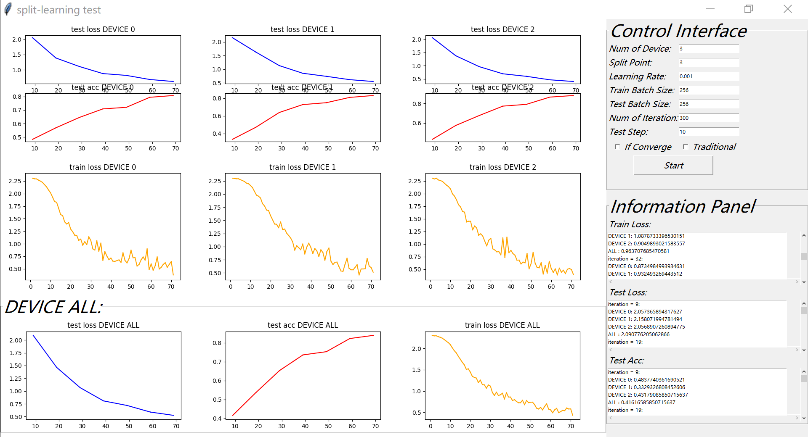

## Material Object

```shell
1、enter dict Processing
enter Processing.py
set num_device, IFTestSplit ..
```

```shell
2、python3 Processing.py
run Processing.py and get train_data_label and test_data_label
it will create train_process and test_process (2 files)
```

```shell
3、move train_process and test_process (2 files) into dict Clients
```

```shell
4、transfer dict Clients to devices
```

```shell
5、DEVICE change IP(host) and run Client0.py(or 1,2,3 ...)
```

```shell
6、SERVER enter dict ServerGUI run Server_GUI.py
or enter dict ServerNOGUI run Server.py
```




### how to use GUI?

```shell
1、Control Interface：
input Num of Device, Split point, Learning Rate,
Train_Batch_Size, Test_Batch_Size, Num of Iteriation
Test step， IF_Converge, Traditional?
then press the button (Start)
```

```shell
2、information will print in Information Panel
loss, acc every device and all device will be drawn 
```


